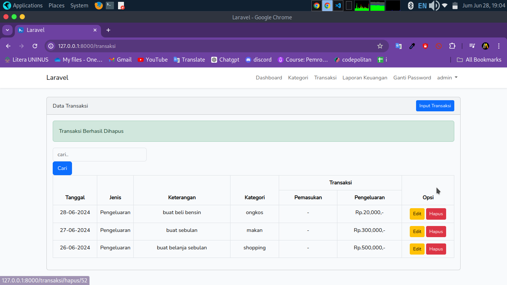

# Laporan Keuangan App

Project Praktikum Matakuliah: Pengembangan Aplikasi Berbasis Kerangka Kerja


## Installation

Clone My Project
   ```bash
  git clone https://github.com/AkhyarAzamta/praktikum-laravel-keuangan-app.git
``` 
Change Directory to Project
   ```bash
  cd praktikum-laravel-keuangan-app
``` 
Install or Update Composer
```bash
  composer update
  ```
  #### Don't forget to Setup Environment Variables (.env)
  Migrate to Database
  ```bash
  php artisan migrate --seed
  ```
  Run Project and Don't forget to give me star:)


## Tech Stack

[PHP 8.1](https://www.php.net/), [Laravel 10](https://laravel.com/docs/10.x)


## Demo

[Coming Soon](#)


